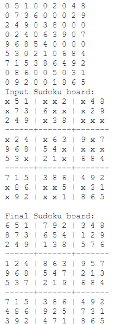

# Sudoku-solver
This is a Sudoku solver that solves any Naked-Single Sudoku board.

Sample input (0 means empty):  
0 5 1 0 0 2 0 4 8  
0 7 3 6 0 0 0 2 9  
2 4 9 0 3 8 0 0 0  
0 2 4 0 6 3 9 0 7  
9 6 8 5 4 0 0 0 0  
5 3 0 2 1 0 6 8 4  
7 1 5 3 8 6 4 9 2  
0 8 6 0 0 5 0 3 1  
0 9 2 0 0 1 8 6 5  

